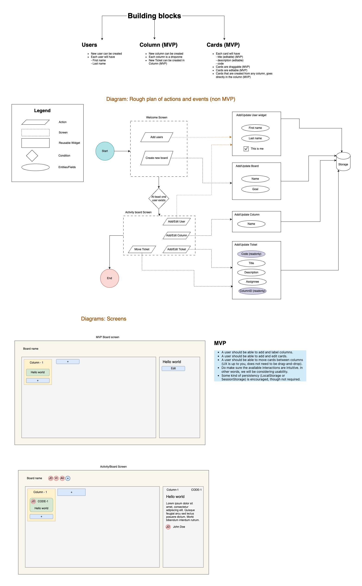

## [Github](https://github.com/SiddharthaChowdhury/ticket-lite) | [History](https://github.com/SiddharthaChowdhury/ticket-lite/commits/main/)

## Getting started

1. After cloning the repo, `cd ticket-lite`
2. `yarn` or `npm i`
3. `yarn start` or `npm start`

## Test

Basic unit tests are added for the data to cover the basic functionality.

- `npm test` to run the unit tests

## Used additional dependencies:

Apart from what comes from a "CRA" setup following were added

1. `styled-components`: Easy styling component based
2. `storybook`: Atomic design library
3. `react-grid-system`: Light-weight grid layout
4. `@dnd-kit/core`: Drag and drop

## Requirements/Features

- ✅ A user should be able to add and label columns. _(Capped it max 4)_
- ✅ A user should be able to add and edit cards. _(referring "cards" as "tickets" in the app)_
- ✅ A user should be able to move cards between columns. _(DragAndDrop added)_
- ✅ Do make sure the available interactions are intuitive. In other words, we will be considering usability.
- ✅ Some kind of persistency (LocalStorage or SessionStorage) is encouraged, though not required. _(Used LocalStorage)_

## To make it a real app following (minimum) need to be implemented:

1. Authentication
2. User roles and permissions (to restrict editing board structure)
3. Settings to add/configure Ticket fields and field-types to suit broader spectrum of customers need when creating tickets
4. Relation between tickets (like "linked", "blocks", "prerequisite", etc)
5. Add tracking and monitoring.
6. Add more testing and cover the code features
7. Wysiwyg editor for description of a ticket
8. Of course ticket ownership (assignee) is required.

## Plan before development

